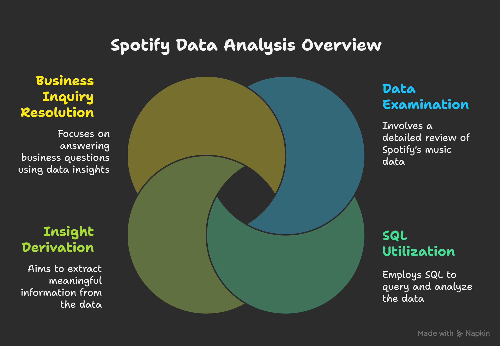
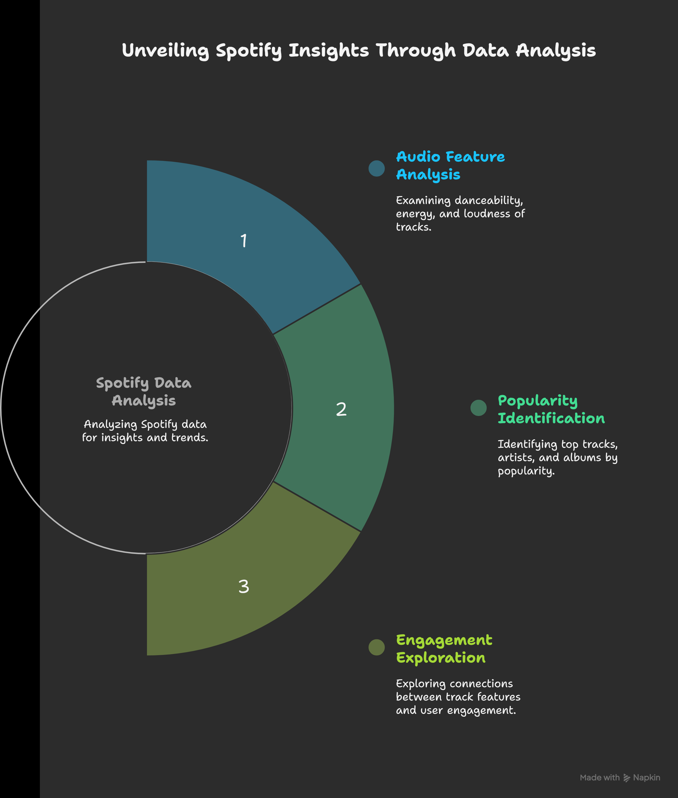
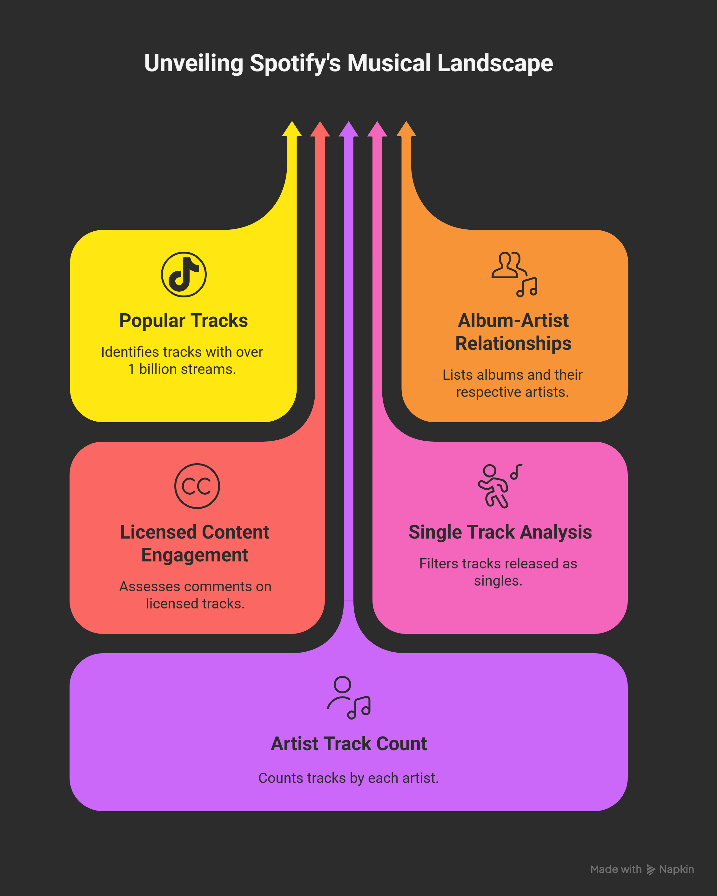
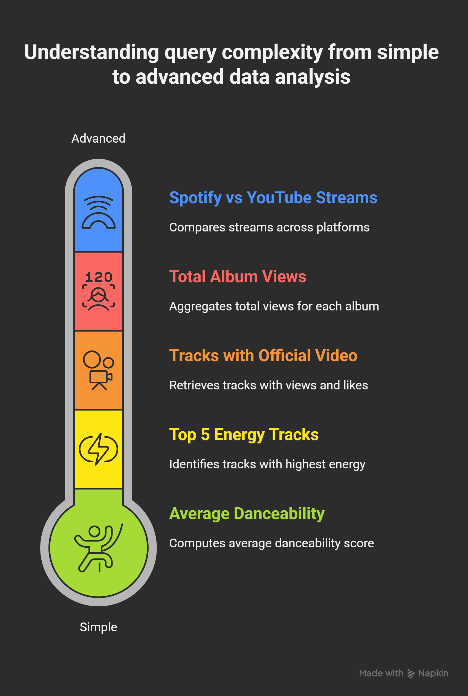

## Spotify Data Analysis using SQL

## Overview
This project involves a comprehensive analysis of Spotify's music data using SQL. The goal is to extract valuable insights and answer various business questions based on the dataset.

## Objectives

- Analyze various audio features like danceability, energy, and loudness.
- Identify popular tracks, artists, and albums based on streams, views, and likes.
- Explore relationships between track characteristics and user engagement.



## Dataset

The data for this project is assumed to be loaded into a table named `spotify`.


## Schema

```sql
CREATE TABLE spotify(
	Artist VARCHAR(50),
	Track VARCHAR(255),
	Album VARCHAR(255),
	Album_type VARCHAR(50),
	Danceability FLOAT,
	Energy FLOAT,
	Loudness FLOAT,
	Speechiness FLOAT,
	Acousticness FLOAT,
	Instrumentalness FLOAT,
	Liveness FLOAT,
	Valence FLOAT,
	Tempo FLOAT,
	Duration_min FLOAT,
	Title VARCHAR(255),
	Channel VARCHAR(250),
	Views BIGINT,
	Likes BIGINT,
	Comments BIGINT,
	Licensed BOOLEAN,
	official_video BOOLEAN,	
	Stream BIGINT,
	nergyLiveness FLOAT,
	most_playedon VARCHAR(50)
);
```

## Business Problems and Solutions


Business problems:
```sql
-- ## Analysis question --

-- ### Easy Level
-- 1. Retrieve the names of all tracks that have more than 1 billion streams.
-- 2. List all albums along with their respective artists.
-- 3. Get the total number of comments for tracks where `licensed = TRUE`.
-- 4. Find all tracks that belong to the album type `single`.
-- 5. Count the total number of tracks by each artist.

-- ### Medium Level
-- 1. Calculate the average danceability of tracks in each album.
-- 2. Find the top 5 tracks with the highest energy values.
-- 3. List all tracks along with their views and likes where `official_video = TRUE`.
-- 4. For each album, calculate the total views of all associated tracks.
-- 5. Retrieve the track names that have been streamed on Spotify more than YouTube.

-- ### Advanced Level
-- 1. Find the top 3 most-viewed tracks for each artist using window functions.
-- 2. Write a query to find tracks where the liveness score is above the average.
-- 3. **Use a `WITH` clause to calculate the difference between the highest and lowest energy values for tracks in each album.**
```
Solving Business Problems
### Easy Level 

### 1. Retrieve the names of all tracks that have more than 1 billion streams.

```sql
SELECT
	track
FROM 
	spotify
WHERE
	stream>1000000000
```

### 2. List all albums along with their respective artists.

```sql
SELECT 
	DISTINCT album,
	artist
FROM 
	spotify	
```

### 3. Get the total number of comments for tracks where `licensed = TRUE`.

```sql
SELECT
	SUM(comments) AS total_comments
FROM
	spotify
WHERE
	licensed=\'true\'
```

### 4. Find all tracks that belong to the album type `single`.

```sql
SELECT 
	track,
	album_type
FROM 
	spotify
WHERE
	album_type=\'single\'
```

### 5. Count the total number of tracks by each artist.

```sql
SELECT 
	artist,
	COUNT(*)  AS total_tracks
FROM
	spotify
GROUP BY 1
ORDER BY 2 DESC;	
```

### Medium Level

### 1. Calculate the average danceability of tracks in each album.

```sql
SELECT
	album,
	AVG(danceability) as average_dancebility
FROM 
	spotify
GROUP BY 1
ORDER BY 2 DESC
```

### 2. Find the top 5 tracks with the highest energy values.

```sql
SELECT 
	track,
	energy
FROM
	spotify
ORDER BY 2 DESC
```

### 3. List all tracks along with their views and likes where `official_video = TRUE`.

```sql
SELECT
	track,
	SUM(views) AS Total_views,
	SUM(likes) AS Total_likes
FROM
	spotify
WHERE
	official_video=\'true\'
GROUP BY 1	
```

### 4. For each album, calculate the total views of all associated tracks.

```sql
SELECT
	album,
	track,
	SUM(views)
FROM
	spotify
GROUP BY 1,2
ORDER BY 3 DESC
```

### 5. Retrieve the track names that have been streamed on Spotify more than YouTube.

```sql
SELECT
	track
FROM
	(SELECT
		track,
		COALESCE(SUM(CASE WHEN most_playedon =\'Spotify\' THEN stream END), 0) AS stream_on_spotify,
	 	COALESCE (SUM(CASE WHEN most_playedon =\'Youtube\' THEN stream END),0) AS stream_on_youtube
	FROM
		spotify
	GROUP BY 1
) AS t1

WHERE
	stream_on_spotify>stream_on_youtube
	AND
	stream_on_youtube<>0
```

### Advanced Level

### 1. Find the top 3 most-viewed tracks for each artist using window functions.

```sql
WITH ranking_of_views
AS(
SELECT 
	artist,
	track,
	SUM(views) AS total_views,
	DENSE_RANK() OVER(PARTITION BY artist ORDER BY SUM(views)) AS rank
FROM
	spotify
GROUP BY 1,2
ORDER BY artist,total_views
)

SELECT
	*
FROM
	ranking_of_views
WHERE 
	rank<=3
```

### 2. Write a query to find tracks where the liveness score is above the average.

```sql
SELECT
	track,
	liveness
FROM
	spotify
WHERE
	liveness>(SELECT
					AVG(liveness)
				FROM
					spotify)
```

### 3. Use a `WITH` clause to calculate the difference between the highest and lowest energy values for tracks in each album.

```sql
WITH all_difference_min_max
AS(
SELECT
	album,
	MAX(energy) AS max_energy,
	MIN(energy) AS min_energy
FROM
	spotify
GROUP BY 1
)
SELECT
	album,
	ROUND((max_energy - min_energy)::NUMERIC, 2) AS difference_between_highest_and_the_lowest_energy
FROM
all_difference_min_max
ORDER BY 1
```


## Author - Dhananjoy

This project is part of my portfolio, showcasing the SQL skills essential for data analyst roles. If you have any questions, feedback, or would like to collaborate, feel free to get in touch!

### Stay Updated and Join the Community

For more content on SQL, data analysis, and other data-related topics, make sure to follow me on social media and join our community:

- **LinkedIn**: [Connect with me professionally](https://www.linkedin.com/in/dhananjoy01)
- **Portfolio**: [My Data Science Portfolio](https://www.datascienceportfol.io/dhananjoychandro01)
- **GitHub**: [My GitHub Profile](https://github.com/dhananjoy01)
- **Gmail**: dhananjoychandro01@gmail.com

Thank you for your support, and I look forward to connecting with you!


### In-depth Explanations of SQL Queries

#### Easy Level

**1. Retrieve the names of all tracks that have more than 1 billion streams.**
This query identifies highly popular tracks by filtering for those with a `stream` count exceeding 1 billion. It's useful for understanding which songs have achieved massive global reach on Spotify.

**2. List all albums along with their respective artists.**
This query provides a distinct list of all albums and their corresponding artists. It helps in cataloging the music library and understanding the artist-album relationships.

**3. Get the total number of comments for tracks where `licensed = TRUE`.**
By summing the `comments` for licensed tracks, this query helps assess user engagement and feedback on officially licensed content, which is crucial for content creators and platforms.

**4. Find all tracks that belong to the album type `single`.**
This query filters tracks to show only those released as singles. This is useful for analyzing the distribution of content types and understanding release strategies.

**5. Count the total number of tracks by each artist.**
This query groups tracks by `artist` and counts the total number of songs each artist has. It helps identify prolific artists and their contribution to the platform.


#### Medium Level

**1. Calculate the average danceability of tracks in each album.**
This query computes the average `danceability` score for tracks within each album. This metric is valuable for understanding the rhythmic and tempo characteristics of an album, which can inform genre classification or listener preferences.

**2. Find the top 5 tracks with the highest energy values.**
This query identifies the tracks with the highest `energy` levels, indicating their intensity and activity. This can be used to curate playlists for high-energy activities or discover upbeat music.

**3. List all tracks along with their views and likes where `official_video = TRUE`.**
This query retrieves tracks that have an `official_video` and displays their `views` and `likes`. It helps in understanding the performance of video content and its engagement metrics.

**4. For each album, calculate the total views of all associated tracks.**
This query aggregates the total `views` for all tracks within each album. It provides an overall measure of an album's popularity based on video consumption.

**5. Retrieve the track names that have been streamed on Spotify more than YouTube.**
This complex query compares stream counts from Spotify and YouTube for each track, identifying songs that perform better on Spotify. It uses `COALESCE` to handle potential NULL values and a subquery to calculate streams from both platforms, offering insights into platform-specific popularity.

#### Advanced Level

**1. Find the top 3 most-viewed tracks for each artist using window functions.**
This query utilizes a `DENSE_RANK()` window function to rank tracks by `views` within each `artist`'s catalog. It's powerful for identifying an artist's most popular songs and can be used for personalized recommendations or artist spotlights.

**2. Write a query to find tracks where the liveness score is above the average.**
This query identifies tracks with a `liveness` score higher than the overall average `liveness` across all tracks. This is useful for discovering songs that have a strong live performance feel, which might appeal to certain listeners.

**3. Use a `WITH` clause to calculate the difference between the highest and lowest energy values for tracks in each album.**
This query uses a `WITH` clause (Common Table Expression) to first find the maximum and minimum `energy` values for each album. Then, it calculates the difference, providing a measure of the energy variation within an album. This helps in understanding the dynamic range of an album's sound.




## Findings and Conclusion

- **Content Popularity:** Analysis of stream counts, views, and likes reveals the most popular tracks and albums, highlighting content that resonates most with the audience.
- **Audio Feature Insights:** By examining danceability, energy, and liveness, we can categorize music based on its intrinsic characteristics, which can inform playlist curation and genre classification.
- **Platform Performance:** Comparing stream counts between Spotify and YouTube provides insights into platform-specific audience preferences and content performance.
- **Artist Performance:** Identifying top tracks and total track counts per artist helps in understanding artist productivity and their impact on the platform.

This analysis provides a comprehensive view of Spotify's content and can help in understanding music trends, user engagement, and content strategy.

